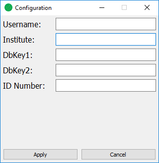

========
Usage
========

To run the program, open a command window inside of the ``bin`` folder.

Make sure you are running Python 3 (by ``running python --version`` on windows or ``python3 --version`` on MacOS/linux).

Finally, run the code:

.. code-block:: python

	python main.py

or

.. code-block:: python

	python3 main.py

depending on which command is used for Python 3.

You should see the program open up. You will find options for a new file, opening, and saving in the File menu.

Configuration
-------------
To input configuration (such as username and institute), go to the File menu and click Configuration. Fill in all
relevant information  and click Apply, then close the window. This information will be saved in the save file.

Navigation
----------
Use the tree on the left side of the program to navigate to the component you wish to mark. (Ex: R0->H1->HCC)

To zoom in and out on an image, use the scroll wheel on your mouse.

To move the image, hold the ``Ctrl`` key to click and drag the image.

To reset the image to fit the window, press the `R` key.

Selection
---------
Use selection window or the image itself to select areas that have been identified. Selectable areas are shown on the
image with a red box. Once clicked, they will turn blue and be added to the selected list.

To select with the edit window, select an entry (or multiple entries while holding Shift) and click the add button.

The comments for selected items can be edited by double clicking the comment space in the selected list.

Saving
------
To save, select the "Save" option on the file menu, and set the location for the save file. All marked pads
and configuration will be stored here.

